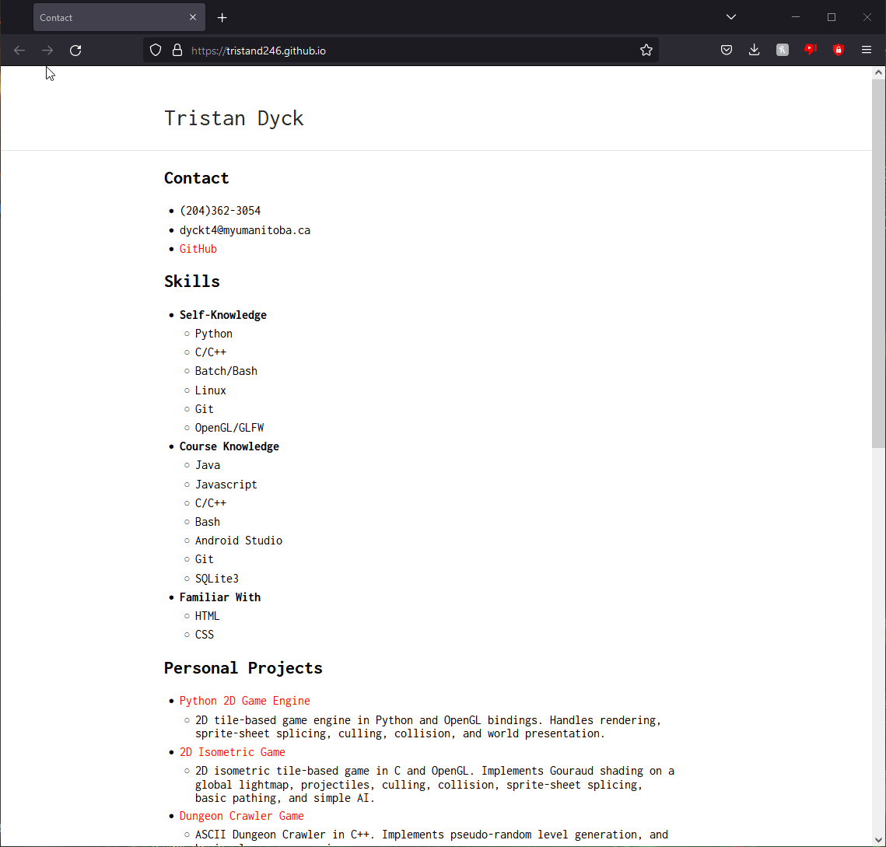

# Public Resume Website Hosting

We will be publically hosting a Resume written in markdown.

## Getting started

This walkthrough is intended for Windows, the process of setting up on other operating systems may vary. Firstly:

- Create a new folder, this will hold all our necessary files in order to host the Resume.

### Prerequisites

- The latest version of [Ruby Devkit](https://rubyinstaller.org/downloads/).
- An editor capable of editing markdown, such as [Visual Studio Code](https://code.visualstudio.com/).
- A valid [Github](https://github.com/) account.

### Installing

Open a command prompt, press **Windows Key+R** type "*cmd.exe*" then hit enter, and type the following:

    gem install jekyll bundler

This will install Jekyll. We then type the following on a **new** command prompt to verify Jekyll installed correctly:

    jekyll -v

***NOTE: Once Jekyll is installed, the command prompt must be closed and re-opened in order to use Jekyll.***

## Setup

### Writing a Resume in Markdown and Visual Studio Code

Writing Markdown within Visual Studio Code is superior to regular text editors as it allows you to preview your documents. The book [Modern Technical Writing](https://github.com/tristand246/tristand246.github.io#more-resources) by Andrew Etter, highly advises writing in light markup languages, like Markup, as opposed to more verbose langauges such as HTML and CSS. Writing in these more verbose languages requires much more time and effort to reach the same end goal. They require more tedious work, which creates more opportunities for mistakes to be made. Hence we are creating a Resume in Markdown with these instructions:

- Open Visual Studio Code
- Click "*File*" at the top left, and select "*New File*"
- Name this file as "*resume.md*" and save.
- Click the icon in the top right with the magnifine glass, this will enable preview mode.

Now you can get started writing your Resume using Markdown, refer to [More Resources](https://github.com/tristand246/tristand246.github.io#more-resources) for Markdown documentation.

### Adding your Resume

- Drag your Resume into your website folder, if you have not yet done so.
- Rename your Resume to the following: `index.md`.

Finally, add this heading to the top of your Resume file:

    ---
    layout: default
    ---

This allows Jekyll to recognize your file and apply your theme.

### Demoing in Jekyll

Using Github Pages exclusively can be annoying if you want to quickly preview changes to your website, as it can take several minutes to update. Here we describe how to set up a local website using Jekyll.

- Download the [Researcher Theme](https://github.com/tristand246/tristand246.github.io#more-resources) by clicking the green "*Code*" button, then "*Download ZIP*".
- Unzip and drag the `_layouts`, `_sass`, and `css` folders into your own website folder.

Create a new file in your folder named `_config.yml` and paste the following contents into it:

    title: "your resume title"
    url: "<your github username>.github.io"
    baseurl: ""

You **MUST** modify the URL variable to fit with your username. Example: `url: "bob123.github.io"`

- Open a new command prompt.
- Enter `jekyll s -s "<path to your website folder>"`
    - Example of a file path: `"C:\Users\Bob\Desktop\website folder"`.
- Enter [127.0.0.1:4000](http://127.0.0.1:4000/) into your browser's address bar to preview your website.

Now you are able to preview your website!

## Public Hosting

Now we will set up your website for public access. There are great advantages to hosting a Resume website as opposed to storing and submitting a PDF. As expressed in Andrew Etters book, [Modern Technical Writing](https://github.com/tristand246/tristand246.github.io#more-resources), websites can be updated almost instantaniously. Whereas a PDF needs to be resubmitted and version control is harder to maintain, especially if you keep multiple versions saved at once.

### Uploading to Github

In order to get our files on Github we must:

- Create a new public repository, giving it your desired name and description. Check the "*Add a README file*" box, under "*Initialize this repository with*".
- Access your newly created repository and select "*Add file*" then "*Upload files*" and drag your folder contents into the dropbox and upload.

### Hosting on Github Pages

- Click on "*Settings*" in your newly created repository.
- Click "*Pages*" on the options list to the left.
- Select the "*main*" branch and click save.

Now your site will be live as soon as Github is finished building, which may take a few minutes.

## More Resources

- [Modern Technical Writing by Andrew Etter](https://www.amazon.ca/Modern-Technical-Writing-Introduction-Documentation-ebook/dp/B01A2QL9SS).
- [Markdown Documentation](https://markdown-guide.readthedocs.io/en/latest/).
- [Researcher Theme](https://github.com/ankitsultana/researcher).

## Authors and Acknowledgements

- Tristan Dyck, Author.
- Noah Curoe, Editor.
- Kunal Rajpal, Editor.
- Alborz Khakbazan, Editor.
- Ankit Sultana, Researcher Jekyll Theme.
- Andrew Etter, Modern Technical Writing.

## FAQ

- ***Q:*** Can I use something else than Github Pages for hosting?
    - ***A:*** Yes, there are many ways to host a website. Including using your own domain name and self hosting, or using a different hosting service, such as [Codeberg Pages](https://codeberg.page/).
- ***Q:*** Can other people access my website when hosted on Jekyll?
    - ***A:*** Not if you hosted it with the method shown in this readme. It is possible to allow local access to your Jekyll hosted website by using a different command for hosting, such as `jekyll s --host 0.0.0.0 --port <port here>`. Furthermore, public access can be allowed by [port forwarding](https://portforward.com/) the port you choose to host with.
